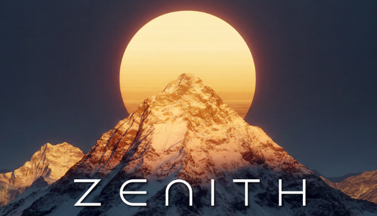

<a name="readme-top"></a>

<!-- PROJECT SHIELDS -->
[![MIT License][license-shield]][license-url]
[![Issues][issues-shield]][issues-url]
[![GitHub contributors][contributors-shield]][contributors-url]
[![GitHub pull requests][pulls-shield]][pulls-url]
[](http://makeapullrequest.com)
<br>
[![GitHub stars][stars-shield]][stars-url]
[![GitHub watchers][watchers-shield]][watchers-url]
[![GitHub forks][forks-shield]][forks-url]
[](https://github.com/RSE-Cambridge)


<!-- PROJECT LOGO -->
<br />
<div align="center">
  <a href="https://RSE-Cambridge.github.io/">
    <picture>
      <source media="(prefers-color-scheme: dark)" srcset="assets/zenith.png">
      
    </picture>
  </a>
  <br>
  <br>
  <br>
  <h1 align="center">LLMs on Zenith</h1>

  <p align="center">
    <a href="https://www.python.org/"></a>
    <a href="https://docs.astral.sh/uv/"></a>
  </p>
  <p align="justify">
    This workshop will introduce users to hitting OpenAI API-compatible LLM endpoints on the Zenith Supercomputer at the University of Cambridge
  </p>
</div>


During this workshop, we will:

- Get an API Key from your available resources on the AIRR Portal  
- Use the API Key to explore a number of available endpoints
- Play around with some LLMs and image models

## Clone this repository

```bash
git clone ...
cd ...
```

This repository uses UV to manage environments, so if you don't have it:

```bash
curl -LsSf https://astral.sh/uv/install.sh | sh
```

More details of installation can be found on the Installing UV page.

Syncing will automatically create a virtual environment and install the packages required for this workshop

```bash
uv sync
```

## Getting your API Key

You should have already received an invite to sign up to our online Waldur portal. We have automatically created a resource for you. 

```bash
cp .env.example .env
```

and just put your API Key in here. We use `dotenv` to load the `base_url` and `api_key`.

## Running the workshop

There are two notebooks available here to play with.

- `example-calls.ipynb` is an intrdduction to some of the basic calls available.  
- `llm-judging.ipynb` sets up an example where we use LLMs to judge the correctness of medical statements.


<!-- LICENSE -->
## License

Distributed under the MIT License. See `LICENSE` for more information.

<p align="right">(<a href="#readme-top">back to top</a>)</p>


<!-- MARKDOWN LINKS & IMAGES -->
<!-- https://www.markdownguide.org/basic-syntax/#reference-style-links -->
[license-shield]: https://img.shields.io/badge/License-MIT-brightgreen.svg
[license-url]: https://github.com/RSE-Cambridge/rsecon26-airr-workshop?tab=MIT-1-ov-file
[issues-shield]: https://img.shields.io/github/issues-raw/RSE-Cambridge/rsecon26-airr-workshop.svg?maxAge=25000
[issues-url]: https://github.com/RSE-Cambridge/rsecon26-airr-workshop/issues
[contributors-shield]: https://img.shields.io/github/contributors/RSE-Cambridge/rsecon26-airr-workshop.svg?style=flat
[contributors-url]: https://github.com/RSE-Cambridge/rsecon26-airr-workshop/graphs/contributors
[pulls-shield]: https://img.shields.io/github/issues-pr/RSE-Cambridge/rsecon26-airr-workshop.svg?style=flat
[pulls-url]: https://github.com/RSE-Cambridge/rsecon26-airr-workshop/pulls
[stars-shield]: https://img.shields.io/github/stars/RSE-Cambridge/rsecon26-airr-workshop.svg?style=social&label=Star
[stars-url]: https://github.com/RSE-Cambridge/rsecon26-airr-workshop/stargazers
[watchers-shield]: https://img.shields.io/github/watchers/RSE-Cambridge/rsecon26-airr-workshop.svg?style=social&label=Watch